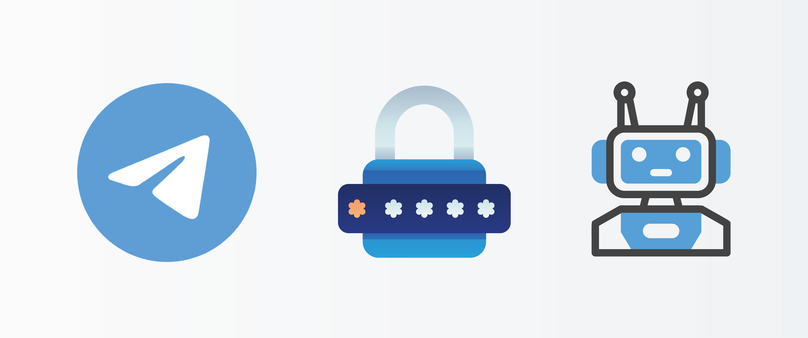

<!--
*** I'm using markdown "reference style" links for readability.
*** Reference links are enclosed in brackets [ ] instead of parentheses ( ).
*** See the bottom of this document for the declaration of the reference variables
*** for contributors-url, forks-url, etc. This is an optional, concise syntax you may use.
*** https://www.markdownguide.org/basic-syntax/#reference-style-links
-->

[![MIT License][license-shield]][license-url]
[![LinkedIn][linkedin-shield]][linkedin-url]
[![Dev.to][dev.to-shield]][dev.to-url]

<!-- PROJECT LOGO -->
 

  

  <h1 align="center">9-Languages-1-Bot</h1>

  <h3 align="center">
    A 9 part 
    <a href="https://dev.to"><strong>DEV</strong></a>
    series on making 1 bot in 9 programming languages.
     
    <a href="https://dev.to/kidesleo/making-a-password-generator-bot-in-9-languages-30fn"><strong>Blog Introduction</strong></a>
  </h3>

## Overview
The project consists of a nine-part series where each part focuses on building the bot using a different programming language. The languages covered include JavaScript/TypeScript, Python, Ruby, Java, C#, Go, PHP, Swift, and Rust. This multi-language approach allows developers to explore different languages and choose the one that best suits their preferences or project requirements.

(<a href="#readme-top">back to top</a>)

## Getting Started
To run the bot, follow the instructions provided in each part of the series corresponding to the programming language of your choice. Each part includes a step-by-step guide for setting up the development environment and running the bot. Ensure that you have the required runtime and dependencies installed as mentioned in the respective tutorial.

(<a href="#readme-top">back to top</a>)

## Contributing

Contributions are what make the open source community such an amazing place to learn, inspire, and create. Any contributions you make are **greatly appreciated**.

If you have a suggestion that would make this better, please fork the repo and create a pull request. You can also simply open an issue with the tag "enhancement".
Don't forget to give the project a star! Thanks again!

1. Fork the Project
2. Create your Feature Branch (`git checkout -b feature/AmazingFeature`)
3. Commit your Changes (`git commit -m 'Add some AmazingFeature'`)
4. Push to the Branch (`git push origin feature/AmazingFeature`)
5. Open a Pull Request

(<a href="#readme-top">back to top</a>)

## License

Distributed under the MIT License. See `LICENSE` for more information.

(<a href="#readme-top">back to top</a>)

## Contact

Email me - [contact@kidus.dev](mailto:contact@kidus.dev)

[LinkedIn][linkedin-url] | [DEV][dev.to-url]

Project Link: [https://github.com/KidesLeo/9-Languages-1-Bot](https://github.com/KidesLeo/9-Languages-1-Bot)

(<a href="#readme-top">back to top</a>)

<!-- MARKDOWN LINKS & IMAGES -->
<!-- https://www.markdownguide.org/basic-syntax/#reference-style-links -->

[dev.to-shield]: https://img.shields.io/badge/dev.to-kidesleo-brightgreen?style=for-the-badge
[dev.to-url]: https://dev.to/kidesleo

[license-shield]: https://img.shields.io/github/license/othneildrew/Best-README-Template.svg?style=for-the-badge
[license-url]: https://github.com/KidesLeo/9-Languages-1-Bot/blob/main/LICENSE

[linkedin-shield]: https://img.shields.io/badge/-LinkedIn-black.svg?style=for-the-badge&logo=linkedin&colorB=555
[linkedin-url]: https://www.linkedin.com/in/kidesleo/

[product-screenshot]: images/screenshot.png
[Next.js]: https://img.shields.io/badge/next.js-000000?style=for-the-badge&logo=nextdotjs&logoColor=white
[Next-url]: https://nextjs.org/
[React.js]: https://img.shields.io/badge/React-20232A?style=for-the-badge&logo=react&logoColor=61DAFB
[React-url]: https://reactjs.org/
[Vue.js]: https://img.shields.io/badge/Vue.js-35495E?style=for-the-badge&logo=vuedotjs&logoColor=4FC08D
[Vue-url]: https://vuejs.org/
[Angular.io]: https://img.shields.io/badge/Angular-DD0031?style=for-the-badge&logo=angular&logoColor=white
[Angular-url]: https://angular.io/
[Svelte.dev]: https://img.shields.io/badge/Svelte-4A4A55?style=for-the-badge&logo=svelte&logoColor=FF3E00
[Svelte-url]: https://svelte.dev/
[Laravel.com]: https://img.shields.io/badge/Laravel-FF2D20?style=for-the-badge&logo=laravel&logoColor=white
[Laravel-url]: https://laravel.com
[Bootstrap.com]: https://img.shields.io/badge/Bootstrap-563D7C?style=for-the-badge&logo=bootstrap&logoColor=white
[Bootstrap-url]: https://getbootstrap.com
[JQuery.com]: https://img.shields.io/badge/jQuery-0769AD?style=for-the-badge&logo=jquery&logoColor=white
[JQuery-url]: https://jquery.com 
